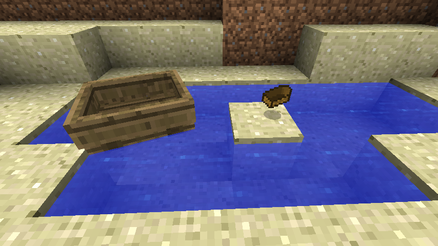

# Good Boat Fix


[](https://modrinth.com/mod/good-boat-fix/)


<!-- modrinth_exclude.start -->
[](https://modrinth.com/mod/good-boat-fix/)
<!-- modrinth_exclude.end -->

Beta 1.7.3 mod to make boats drop boats instead of sticks and planks when broken.



## Compatibility

This mod is incompatible with [UniTweaks](<https://modrinth.com/mod/unitweaks>) "boats drop themselves" tweak, though it
works slightly differently. Both mods may be installed simultaneously, but Good Boat Fix will disable itself if it 
detects that UniTweaks is installed and the tweak is enabled. Disable one or the other in the config.

## Requirements

- Minecraft Beta 1.7.3
- [Babric](<https://babric.github.io/use/installer/>)
- [StationAPI](<https://modrinth.com/mod/stationapi>)
- [Fabric Language Kotlin](<https://modrinth.com/mod/fabric-language-kotlin>)
- [Glass Config API](<https://modrinth.com/mod/glass-config-api>)

## Recommended

- [Mod Menu Babric](<https://modrinth.com/mod/modmenu-babric>) (for in-game configuration)

## Configuration

The mod's configuration can be configured in-game (if [Mod Menu Babric](<https://modrinth.com/mod/modmenu-babric>) is
installed) or in `.minecraft/config/good-boat-fix/good-boat-fix.yml`. The tweak can be disabled without having to
uninstall the mod:

```yml
boatsDropBoatItem: false
```

## License

This mod is licensed under the [MIT license](../LICENSE). 
