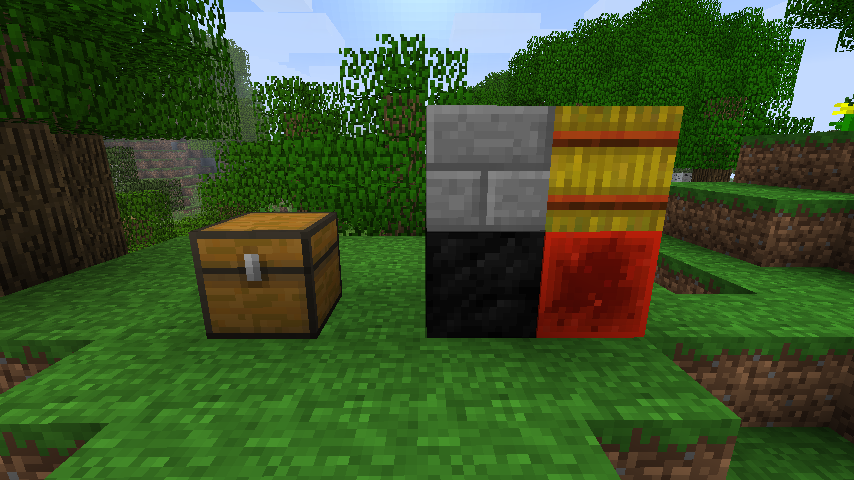
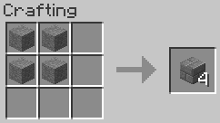
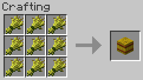
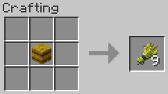
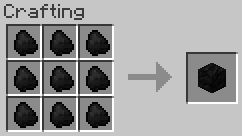
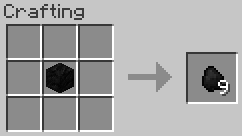
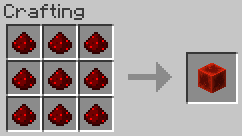
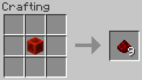

# Good Compression


[](https://modrinth.com/mod/good-compression/)


<!-- modrinth_exclude.start -->
[](https://modrinth.com/mod/good-compression/)
<!-- modrinth_exclude.end -->

Beta 1.7.3 mod to add compressed blocks such as Stone Bricks, Hay Bales, Coal Blocks, and Redstone Blocks.



## Blocks

#### Stone Bricks



4x Stone → 4x Stone Bricks. Stacks to 64x.

#### Hay Bale



9x Wheat → 1x Hay Bale. Stacks to 64x.



1x Hay Bale → 9x Wheat.

#### Coal Block



9x Coal → 1x Coal Block. Stacks to 64x.



1x Coal Block → 9x Coal.

#### Redstone Block

The redstone blocks function properly as redstone blocks, though behaviour may differ slightly to newer versions of the
game. See technical notes below for more details.



9x Redstone → 1x Redstone Block. Stacks to 64x.



1x Redstone Block → 9x Redstone.

## Requirements

- Minecraft Beta 1.7.3
- [Babric](<https://babric.github.io/use/installer/>)
- [StationAPI](<https://modrinth.com/mod/stationapi>)
- [Fabric Language Kotlin](<https://modrinth.com/mod/fabric-language-kotlin>)
- [Good Asset Fetcher](<https://modrinth.com/mod/good-asset-fetcher>)

## Recommended

- [Mod Menu Babric](<https://modrinth.com/mod/modmenu-babric>) (for in-game configuration)

## Configuration

The mod's configuration can be configured in-game (if [Mod Menu Babric](<https://modrinth.com/mod/modmenu-babric>) is
installed) or in `.minecraft/config/good-compression/good-compression.yml`. The redstone dust tweak can be disabled 
without having to uninstall the mod:

```yml
redstoneDustOnTopOfBlocks: false
```

## Technical notes

#### Assets

The mod obtains assets from Minecraft 1.12.2 dynamically on startup, thanks to 
[Good Asset Fetcher](https://modrinth.com/mod/good-asset-fetcher). This allows the mod to utilise textures from other
versions of the game without having to include them in its own source code or jar, avoiding licensing risks.

To replace the assets with your own texture pack or resource pack, they must be placed in: 
`assets/good-compression/stationapi/textures/block`

#### Redstone Blocks

The Redstone Blocks have a material of 'Glass'. The reason for this is that, in this version, the game's redstone logic 
prevents solid blocks from transmitting redstone. Furthermore, some mods, such as 
[NyaLib](<https://modrinth.com/mod/nyalib>), make tweaks to the game's redstone logic which bypasses this material 
check. To maintain maximum compatibility without affecting the game's redstone code (modded or not), we chose to go with
making the block transparent as it originally was in the first few post-release versions.

In order to allow placing redstone dust on top of the transparent Redstone Block, a tag has been added: 
`good-compression/redstone_dust_placeable`. Blocks with this tag will allow redstone dust to be placed on top of them,
even if they otherwise fail the placement test.

## License

This mod is licensed under the [MIT license](../LICENSE). Assets are obtained dynamically at runtime in compliance with
Minecraft's license.
