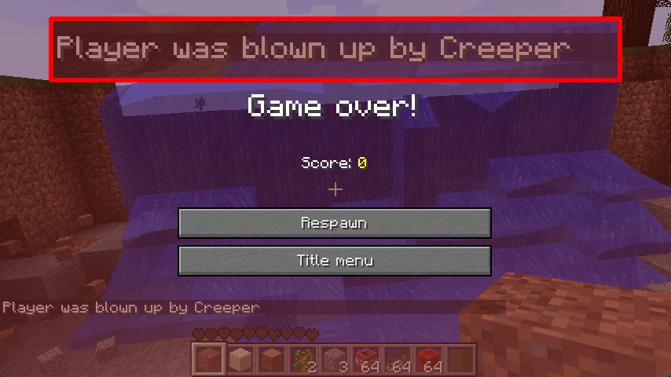

# Good Death Messages


[](https://modrinth.com/mod/good-mod-template/)


<!-- modrinth_exclude.start -->
[](https://modrinth.com/mod/good-mod-template/)
<!-- modrinth_exclude.end -->

Beta 1.7.3 mod that adds death messages faithful to newer versions of Minecraft. Works in both singleplayer and
multiplayer.



Adds the following death messages:
- `<player> died`
- `<player> fell out of the world`
- `<player> hit the ground too hard`
- `<player> fell from a high place`
- `<player> fell off a ladder`
- `<player> was slain by <entity>`
- `<player> was shot by <player>`
- `<player> was pummeled by <entity>`
- `<player> was blown up by <entity>`
- `<player> was blew up`
- `<player> was fireballed by <entity>`
- `<player> was pricked to death`
- `<player> was struck by lightning`
- `<player> was killed by [Intentional Game Design]`
- `<player> drowned`
- `<player> burned to death`
- `<player> suffocated in a wall`

And includes some additional non-standard messages, which can be disabled:
- `<player> was mauled to bits by <player>'s <wolf>`
- `<player> was mauled to bits by <wolf>`
- `<player> belly flopped into a puddle`
- `<player> drowned to a crisp`

## Requirements

- Minecraft Beta 1.7.3
- [Babric](<https://babric.github.io/use/installer/>)
- [StationAPI](<https://modrinth.com/mod/stationapi>)
- [Fabric Language Kotlin](<https://modrinth.com/mod/fabric-language-kotlin>)

## Recommended

- [Mod Menu Babric](<https://modrinth.com/mod/modmenu-babric>) (for in-game configuration)

## Configuration

The mod's configuration can be configured in-game (if [Mod Menu Babric](<https://modrinth.com/mod/modmenu-babric>) is
installed) or in `.minecraft/config/good-death-messages/good-death-messages.yml`.

```yml
deathMessagesEnabled: true

# Enables Good Death Messages' own additional death messages. 
# Does not affect any other mods adding their own death messages.
customDeathMessagesEnabled: true
```

## Translations

Currently, messages are only in en_US. If you would like to provide localization for a language, contribute  
[here](https://github.com/tmpim/my-good-mods/tree/master/good-death-messages/src/main/resources/assets/good-death-messages).

## License

This mod is licensed under the [MIT license](../LICENSE). 
