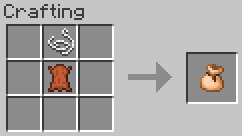
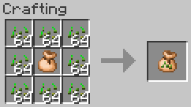
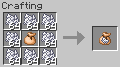

# Good Farming 


[](https://modrinth.com/mod/good-farming/)


<!-- modrinth_exclude.start -->
[](https://modrinth.com/mod/good-farming/)
<!-- modrinth_exclude.end -->

Beta 1.7.3 additions and tweaks to make farming easier.

Adds a Seed Bag, which stores up to 512 Seeds or Bone Meal, and plants on farmland in a 7×5×7 area by right-clicking
it on top of a block. The bag can also be used from further away than regular items (5 blocks). A Seed Bag can only hold 
one type of item, and cannot be emptied other than by using it.

Other tweaks include:
- Nerfs crop trampling, replicating the behaviour of modern versions where you need to fall from a height to trample
  the crops instead.
- Prevents consuming Bone Meal when used on fully grown wheat and saplings that can't grow (doesn't affect modded 
  blocks)
- Quick replanting by right-clicking on crops if you have the seeds


## Items

#### Seed Bag



1x String + 1x Leather (shaped) → 1x Seed bag. Holds 512 seeds.

#### Seed Bag + Seeds



1x Seed Bag + any amount of Seeds (shapeless) to fill the Seed Bag. Up to 512 Seeds.

#### Seed Bag + Bone Meal



1x Seed Bag + any amount of Bone Meal (shapeless) to fill the Seed Bag. Up to 512 Bone Meal.

## Compatibility

This mod has no known major compatibility issues. Functionality on modded blocks by design isn't effective without
adding datapack entries; see [Data packs](#data-packs). 

The mod adds explicit compatibility with [Always More Items](<https://modrinth.com/mod/always-more-items>).

## Requirements

- Minecraft Beta 1.7.3
- [Babric](<https://babric.github.io/use/installer/>)
- [StationAPI](<https://modrinth.com/mod/stationapi>)
- [Fabric Language Kotlin](<https://modrinth.com/mod/fabric-language-kotlin>)
- [Glass Config API](<https://modrinth.com/mod/glass-config-api>)
- [Glass Networking](<https://modrinth.com/mod/glass-networking>)

## Recommended

- [Mod Menu Babric](<https://modrinth.com/mod/modmenu-babric>) (for in-game configuration)

## Configuration

The mod's configuration can be configured in-game (if [Mod Menu Babric](<https://modrinth.com/mod/modmenu-babric>) is
installed) or in `.minecraft/config/good-farming/good-farming.yml`.

```yml
# If enabled, farmland is only trampled when jumping, not walking
tramplingNerfEnabled: true

# Prevents consuming Bone Meal when used on fully grown wheat 
# and saplings that can't grow (doesn't affect modded blocks)
bonemealWastageFixEnabled: true

# Allow replanting crops with right-click (if you have the seeds)
quickReplantingEnabled: true

# The lateral radius, in blocks, to plant seeds with the Seed Bag
seedBagPlantLateralRadius: 3

# The vertical radius, in blocks, to plant seeds with the Seed Bag
seedBagPlantVerticalRadius: 2

# The range, in blocks, that the Seed Bag can be used from
seedBagThrowRange: 5.0

# The maximum number of seeds the Seed Bag can store
seedBagCapacity: 512

# Displays the amount of seeds in the Seed Bag in the hotbar and inventory
seedBagOverlayEnabled: true
```

## Data packs

#### Seed types

The types of seeds that can be placed in a Seed Bag are provided via datapacks in the `good-farming:seed_types`
namespace. For example, `data/good-farming/good-farming/seed_types/bone_meal.json`:

```json
{
  "item": {
    "id": "minecraft:dye",
    "damage": 15
  },
  "textureId": "good-farming:item/seed_bag_bone_meal",
  "plantOnBlocks": [
    {
      "id": "minecraft:wheat"
    },
    {
      "id": "minecraft:sapling"
    },
    {
      "tag": "good-farming:crops"
    },
    {
      "tag": "good-farming:saplings"
    }
  ]
}
```

- **item**: Object describing the item that can be placed in the Seed Bag. Seed placement will use the behaviour of 
  this item, or if it's a tag, the first item loaded by the game in that tag.
  - **id**: The ID of the item. Must be specified if **tag** is not.
  - **tag**: The item tag to use. Must be specified if **id** is not.
  - **damage**: (optional) If **id** is specified, the damage value of the item to match. Leave blank or set to -1 to
    match all damage values.
- **textureId**: (optional) The resource ID of the texture to use for the Seed Bag when it contains these seeds. If a
  texture isn't specified, it will fall back to the empty Seed Bag texture.
- **plantOnBlocks*: (optional) List of blocks that seeds will attempt to be planted on. If not specified, they will
  be planted on any block that the item's class can use.
  - **id**: The ID of the block to use. Must be specified if **tag** is not.
  - **tag**: The block tag to use. Must be specified if **id** is not.
  - **meta**: (optional) If **id** is specified, the meta value of the block to match. Leave blank or set to -1 to
    match all meta values.

Mods can provide their own seed types by placing the corresponding JSON files in `data/$modId/good-farming/seed_types`.
Good Farming also provides an API for datagenning seed types with
[stapi-datagen](<https://github.com/EmmaTheMartian/stapi-datagen>): 
[SeedTypeProvider](<https://github.com/tmpim/my-good-mods/blob/HEAD/good-farming/src/main/java/pw/tmpim/goodfarming/api/SeedTypeProvider.kt>).
See [GoodFarmingSeedTypeProvider.kt](<https://github.com/tmpim/my-good-mods/blob/master/good-farming/src/main/java/pw/tmpim/goodfarming/data/GoodFarmingSeedTypeProvider.kt>) for an example.

Note that StationAPI currently doesn't support loading datapacks outside of mods. If you as a player or server admin
would like to modify the built-in seed types, you can do this by wrapping your datapack in a mod:

1. Create a folder for your datapack, e.g. `good-farming-example`.
2. Place your JSON files in `good-farming-example/data/good-farming-example/good-farming/seed_types`.
3. Place a [`fabric.mod.json`](<https://wiki.fabricmc.net/documentation:fabric_mod_json>) 
   ([spec](<https://wiki.fabricmc.net/documentation:fabric_mod_json_spec>)) file in the root with the following 
   contents:
    ```json
    {
      "schemaVersion": 1,
      "id": "good-farming-example",
      "version": "1.0.0",
      "name": "Good Farming Example",
      "description": "Your own changes to Good Farming's data here!"
    }
    ```
   Note that `name` and `description` are technically optional, but Mod Menu will crash if they're not set.
4. Zip the *contents* of the datapack's folder. i.e. the root of the zip should contain `fabric.mod.json` and `data`.
5. Rename the zip to `.jar`, e.g. `good-farming-example.jar`.
6. Place the jar in your `mods` folder, e.g. `.minecraft/mods/good-farming-example.jar`.
7. Restart the game.

## License

This mod is licensed under the [MIT license](../LICENSE). 
