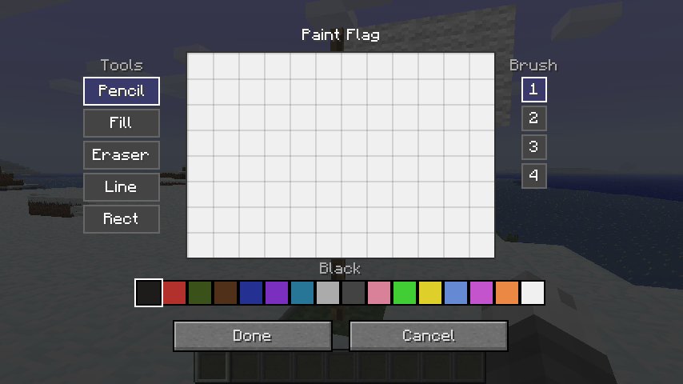
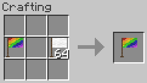
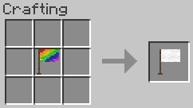

# Good Flags

<!-- modrinth_exclude.start -->

<!-- modrinth_exclude.end -->

Beta 1.7.3 mod to add flags to the game. Flags have a 48×32 canvas supporting the 16 colours of
wool, and can be painted on by players by right-clicking the flag.

## Items

#### Flag

3x Stick + 4x Wool → 1x Flag. Any wool can be used.

## Painting

Right-clicking a placed flag pole opens the paint editor.

### Canvas

The flag's canvas is **48 × 32 pixels** using the 16 wool colours as a palette.

### Tools

| Tool | Description |
|------|-------------|
| Pencil | Freehand drawing. Respects brush size. |
| Eraser | Erases pixels back to white. Respects brush size. |
| Fill | Flood-fills a contiguous region with the selected colour. |
| Line | Draws a straight line between two points. Respects brush size. |
| Rect | Draws a filled rectangle. |
| Circle | Draws a filled ellipse. |

### Undo / Redo

The paint screen supports up to **32 levels** of undo/redo history.

| Action | Shortcut |
|--------|----------|
| Undo | Ctrl+Z |
| Redo | Ctrl+Y or Ctrl+Shift+Z |

## Flag Item

### Design Preserved on Break

Breaking a painted flag drops it as an item that carries the full pixel data. Placing the item
down restores the original design exactly.

### Inventory Preview

A downsampled miniature of the flag's design is rendered on top of the item icon in inventory
slots, giving you a quick visual reference without needing to place the flag.

### Copying a Flag

Place a **blank flag and a painted flag** together anywhere in the crafting grid to produce a
copy of the painted flag. The painted source is not consumed.

### Clearing a Flag

Place a **painted flag alone** in the crafting grid to receive a blank flag back.

## Configuration

Configuration is exposed via [Glass Config API](https://modrinth.com/mod/glass-config-api) and
can be edited in-game with [Mod Menu Babric](https://modrinth.com/mod/modmenu-babric).

| Option                  | Default | Description                                                    |
|-------------------------|---------|----------------------------------------------------------------|
| Item Renderer Enabled   | `true`  | Draw the flag preview on the item icon in inventory.           |
| Item Texture Resolution | `16`    | Base icon resolution in pixels; increase for HD texture packs. |
| Flag Preview X          | `3`     | X offset of the preview region within the item icon.           |
| Flag Preview Y          | `0`     | Y offset of the preview region within the item icon.           |
| Flag Preview Width      | `12`    | Width of the preview region (item pixels).                     |
| Flag Preview Height     | `8`     | Height of the preview region (item pixels).                    |

## Compatibility

This mod has no known compatibility issues. It adds explicit compatibility with
[Always More Items](https://modrinth.com/mod/always-more-items) and
[Entity Culling](https://modrinth.com/mod/entityculling).

## Requirements

- Minecraft Beta 1.7.3
- [Babric](<https://babric.github.io/use/installer/>)
- [StationAPI](<https://modrinth.com/mod/stationapi>)
- [Fabric Language Kotlin](<https://modrinth.com/mod/fabric-language-kotlin>)
- [Glass Config API](<https://modrinth.com/mod/glass-config-api>)
- [Glass Networking](<https://modrinth.com/mod/glass-networking>)

## Recommended

- [Mod Menu Babric](<https://modrinth.com/mod/modmenu-babric>) (for in-game configuration)

## License

This mod is licensed under the [MIT license](../LICENSE).
