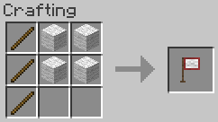

# Good Flags

<!-- modrinth_exclude.start -->

<!-- modrinth_exclude.end -->

Beta 1.7.3 mod to add flags to the game. Flags have a 48x32 canvases supporting the 16 colours of wool, and can be
painted on by players by right-clicking the flag.

## Items

#### Flag

3x Stick + 4x Wool → 1x Flag. Any wool can be used. 

A flag is approximately 3 blocks tall and 2 blocks wide, and is placed facing towards the player. The flag can be 
painted on by right-clicking it. The flag's canvas area is 48 by 32 pixels.

## Compatibility

This mod has no known compatibility issues. It adds explicit compatibility with
[Always More Items](<https://modrinth.com/mod/always-more-items>).

## Requirements

- Minecraft Beta 1.7.3
- [Babric](<https://babric.github.io/use/installer/>)
- [StationAPI](<https://modrinth.com/mod/stationapi>)
- [Fabric Language Kotlin](<https://modrinth.com/mod/fabric-language-kotlin>)
- [Glass Config API](<https://modrinth.com/mod/glass-config-api>)
- [Glass Networking](<https://modrinth.com/mod/glass-networking>)

## Recommended

- [Mod Menu Babric](<https://modrinth.com/mod/modmenu-babric>) (for in-game configuration)

## License

This mod is licensed under the [MIT license](../LICENSE). 
