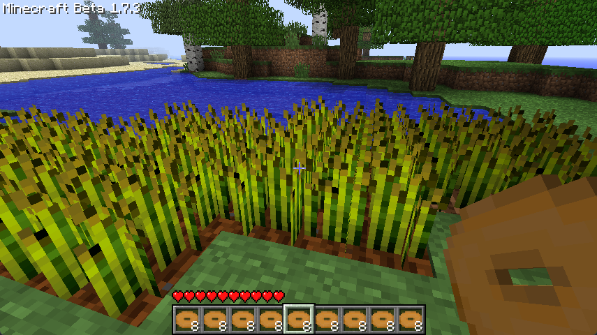
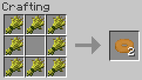

# Good Food

<!-- modrinth_exclude.start -->

<!-- modrinth_exclude.end -->

Adds additional food to Minecraft Beta 1.7.3.

Currently only adds bagels, but more foods are planned.

## Items

#### Bagel

8x Wheat → 2x Bagel. Heals 2.5 hearts. Stacks to 8x.

## Requirements

- Minecraft Beta 1.7.3
- [Babric](<https://babric.github.io/use/installer/>)
- [StationAPI](<https://modrinth.com/mod/stationapi>)
- [Fabric Language Kotlin](<https://modrinth.com/mod/fabric-language-kotlin>)

## License

This mod is licensed under the [MIT license](../LICENSE). The Bagel texture is used with permission from 
[Bagel's Baking](https://modrinth.com/mod/bagels-baking), which is also MIT licensed.
